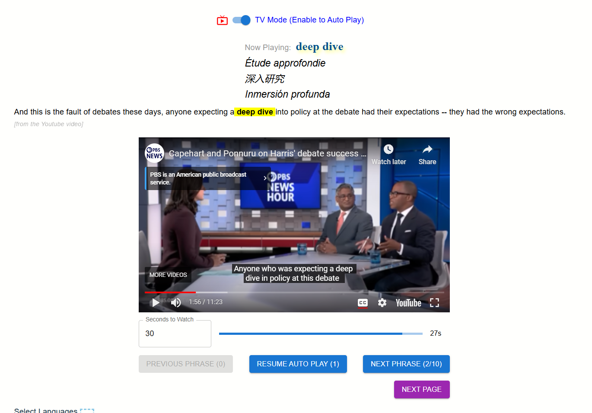

# US Political Analysis Phrases

https://pap.profoundwords.us/

- [US Political Analysis Phrases](#us-political-analysis-phrases)
  - [Website Introduction](#website-introduction)
  - [Main features and functionalities](#main-features-and-functionalities)
    - [Latest Phrases](#latest-phrases)
    - [TV Mode](#tv-mode)
    - [Top Popular Phrases](#top-popular-phrases)
    - [Phrases Puzzle](#phrases-puzzle)
    - [Search Phrases](#search-phrases)
    - [Quick All](#quick-all)
  - [Technologies used](#technologies-used)
  - [Educational Value](#educational-value)
  - [Use of PBS Content](#use-of-pbs-content)
    - [Video Embedding](#video-embedding)
    - [Phrase Extraction](#phrase-extraction)
    - [Attribution and Linking](#attribution-and-linking)
    - [Limited Usage](#limited-usage)
  - [How PAP can benefit PBS](#how-pap-can-benefit-pbs)
  - [Contact](#contact)

## Website Introduction

Political Analysis Phrases (PAP) is an innovative educational website designed to enhance language learning and political discourse analysis through the power of idiomatic expressions and proverbs. Our platform leverages cutting-edge programming technologies to extract key phrases from PBS YouTube videos, translating them into 30 diverse languages and presenting them alongside contextual video clips.

PAP aims to create a unique learning experience by combining linguistic insights with real-world political discourse. By partnering with PBS, we believe we can offer an unparalleled resource for language learners, political science students, and anyone interested in understanding the nuances of political communication across cultures.

## Main features and functionalities

### Latest Phrases

- Phrase Extraction: Users can access a curated list of the latest idiomatic expressions and proverbs from PBS YouTube videos.
- Talk Snippet: Each phrase is accompanied by a brief video snippet that showcases its usage in context.

- Explanation: Detailed explanations provide users with insights into the meaning and application of each phrase.
- Similar Phrases: Each phrase is translated into 30 different languages, including Chinese, Spanish, Hindi, Arabic, French, Portuguese, Russian, German, Japanese, and Korean, among others.

- Video Date: Users can view the date of the original video for context.

- Share Feature: Users can easily share phrases on social media platforms.

### TV Mode

This feature allows users to watch YouTube videos starting at the moment a specific phrase is used. It provides a quick and engaging way to see how phrases are integrated into conversations.

### Top Popular Phrases

A dedicated section highlights the most popular phrases on the platform, allowing users to quickly access trending content and enhance their learning experience.

### Phrases Puzzle

An interactive game designed to help users learn phrases through a puzzle format. This feature not only makes learning enjoyable but also allows users to print puzzles for offline practice.

### Search Phrases

Users can search for phrases using prefix searches or keyword searches, making it easy to find specific idioms or proverbs relevant to their interests.

### Quick All

This feature enables users to print all phrases along with their similar translations in selected languages. It serves as a handy tool for quick reference and memorization, similar to flashcards.

## Technologies used

- Phrase Extraction:
  
  Utilizing AI to automatically identify and extract idiomatic expressions, proverbs, and other significant phrases from PBS YouTube video transcripts.

- Translation:
  
  Utilizing AI to translate the extracted phrases into 30 different languages. This technology goes beyond literal translations, capturing the essence and cultural context of each phrase.

## Educational Value

- Contextual Learning: Users gain exposure to idiomatic expressions and proverbs in real-world political contexts, enhancing their understanding of how language is used in professional and public discourse.

- Multilingual Proficiency: With translations available in 30 languages, PAP supports language learners in developing proficiency across multiple tongues, fostering global communication skills.

- Audio-Visual Reinforcement: The combination of text, translation, and video snippets provides a multi-sensory learning experience, which has been shown to improve retention and comprehension.

- Interactive Learning: Features like the Phrases Puzzle game and TV Mode encourage active engagement with the content, promoting better memorization and application of new phrases.

## Use of PBS Content

Political Analysis Phrases (PAP) integrates content from PBS YouTube videos to provide a rich, contextual learning experience. Use of PBS content is carefully designed to enhance educational value while respecting intellectual property rights. Here's how we utilize PBS material:

### Video Embedding

PAP embeds short, 30-second clips from PBS YouTube videos that contain the extracted phrases.
These clips provide crucial context, allowing users to see and hear how the phrases are used in real political discourse.
The embedded videos are directly linked to the original PBS YouTube content, ensuring proper attribution and driving traffic back to PBS channels.

### Phrase Extraction

Using AI to analyzes PBS video transcripts to identify key idiomatic expressions, proverbs, and other significant phrases.
These extracted phrases form the core of educational content, serving as the basis for translations and explanations.

### Attribution and Linking

All PBS content used on PAP is clearly attributed to its source.
PAP provide links back to the original PBS videos, encouraging users to engage with the full content on PBS platforms.

### Limited Usage

Use of PBS content is limited to short clips and extracted phrases, ensuring that we do not reproduce substantial portions of PBS programming.
The 30-second limit on video clips is designed to fall within fair use guidelines while still providing necessary context for language learners.

## How PAP can benefit PBS

- Enhanced Educational Value:
  
  PAP could complement PBS's existing educational initiatives by providing a specialized tool for language learning and political discourse analysis. This aligns with PBS's mission to educate and inspire

- Innovative Use of PBS Content:
  
  PAP's AI-powered phrase extraction could showcase PBS content in a new, interactive way, potentially increasing engagement with PBS's video materials

- Alignment with PBS's Digital Strategy:
  
  PAP's digital platform aligns with PBS's efforts to reach audiences through various digital channels, including mobile and connected devices

- Support for Multicultural Programming:
  
  PAP's multilingual capabilities could assist PBS in developing and enhancing its multicultural content offerings

## Contact

Profound Words

https://profoundwords.us/
